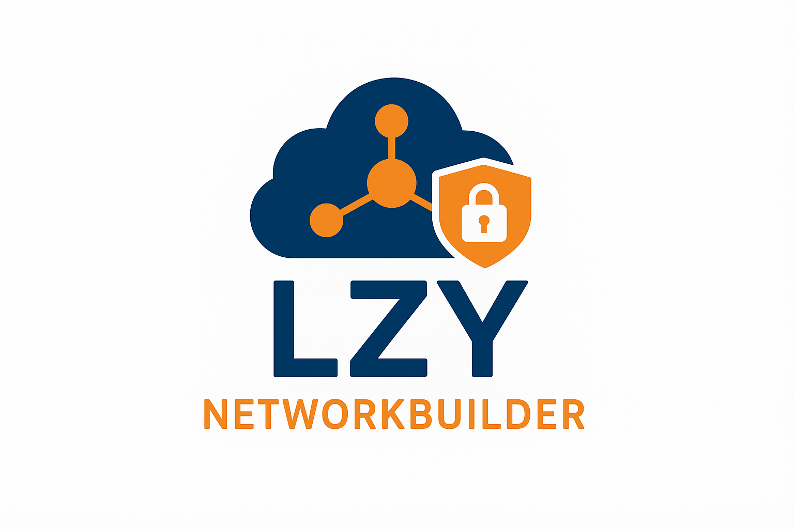
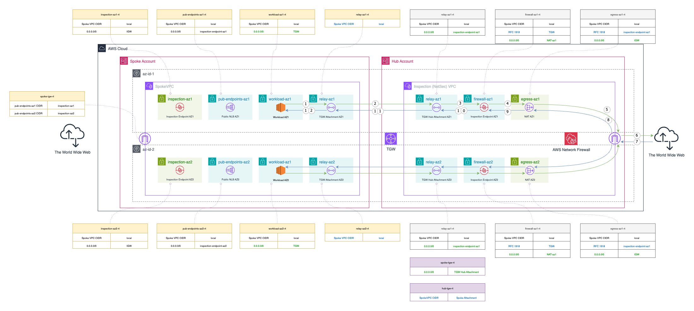
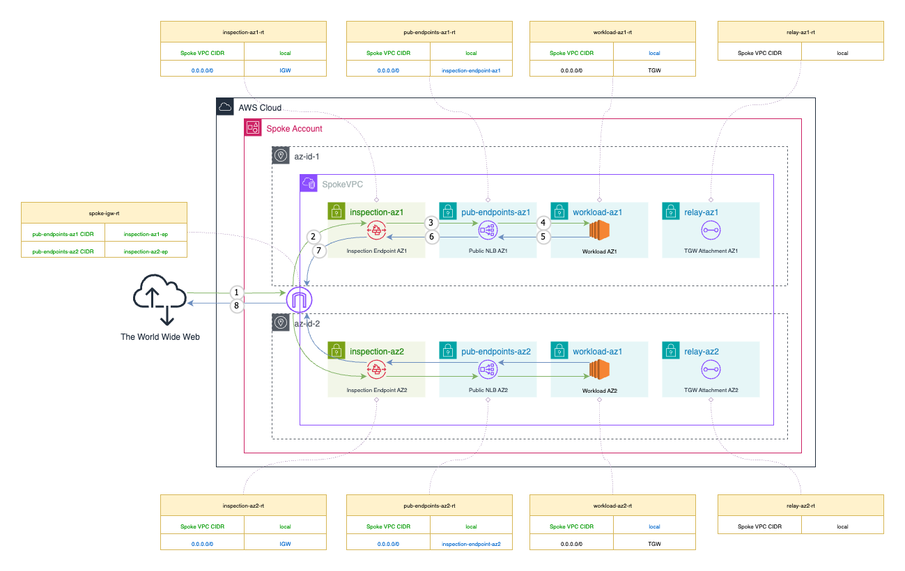

<div align="center">
  
</div>

# LZYNetworkBuilder

LZYNetworkBuilder provides an opinionated framework for managing a secure, production-ready AWS landing zone networking stack.

The architecture it implements follows the "decentralized ingress, centralized egress" pattern.

Deployment of the network stack is regional, in alignment with AWS Prescriptive Guidance. Inter-region connectivity is intentionally left out of scope for this codebase and should be handled separately, based on specific organizational needs.

## OpenTofu Required

**This project requires OpenTofu and cannot be used with Terraform.** The codebase uses dynamic AWS provider blocks to automatically configure cross-account access based on spoke account IDs defined in YAML configuration files. This functionality requires OpenTofu's [dynamic provider capabilities](https://opentofu.org/docs/language/providers/configuration/#for_each-multiple-instances-of-a-provider-configuration).

Use the `tofu` command for all operations instead of `terraform`.

## Usage As a Registry Module

See the [examples/basic-deployment](examples/basic-deployment/) directory for a complete working example.

## AWS Services Used

LZYNetworkBuilder deploys and manages the following AWS services:

| Category | AWS Service |
|----------|-------------|
| **Core Networking** | Amazon VPC |
| | AWS Transit Gateway |
| | NAT Gateways |
| | Elastic IP Addresses |
| **Network Security** | AWS Network Firewall |
| | Gateway Load Balancer |
| **Cross-Account Resource Sharing** | AWS Resource Access Manager (RAM) |
| **DNS** | Route 53 Resolver Profiles |

## How It Works — Quickstart

### Account Architecture

The stack requires a minimum of two AWS accounts under a single AWS Organization: one hub account and at least one spoke account.

AWS Resource Access Manager (RAM) integration must be [enabled](https://docs.aws.amazon.com/organizations/latest/userguide/services-that-can-integrate-ram.html) for everything to work as expected.

**Spoke Accounts**
- Spoke accounts host end-user workloads such as load balancers, servers, and applications
- These accounts are provisioned for end-user teams, who are free to manage their workloads independently

**Hub Account**  
- The hub account acts as the central network and security control plane
- Only infrastructure teams — such as cloud engineering or networking — are granted access to it

### Configuration Management

All accounts are defined through YAML configuration files. The hub account physically creates and owns all VPCs, subnets, and route tables. Selected subnets are then shared with the corresponding spoke accounts via AWS Resource Access Manager, giving end-users access to the resources they need. Other subnets remain isolated and hidden from the spoke accounts to maintain security boundaries.

Configuration files are regional, and must be named "aws_region_name.yaml"

**Configuration File Locations:**
- **Spoke VPC networks**: e.g., `spokes/us-east-1.yaml`
- **Hub VPC networks**: e.g., `hub/us-east-1.yaml`

### Spoke Account Types

Spoke accounts can be classified as:

**Public Accounts**
- Workloads can publish internet-facing endpoints within the VPC
- All inbound traffic to these endpoints is routed through a firewall located in the hub account for inspection

**Private Accounts**
- Workloads cannot publish internet-facing endpoints

### Spoke VPCs + Hub Example Deployment

Deploy both spoke VPCs and a network security hub in a specific region:

```bash
# Deploy US East 1
tofu init
tofu plan \
  -var="spokes_definition=spokes/us-east-1.yaml" \
  -var="hub_definition=hub/us-east-1.yaml"
tofu apply \
  -var="spokes_definition=spokes/us-east-1.yaml" \
  -var="hub_definition=hub/us-east-1.yaml"
```

## Network Flow Types Explained

### Centralized Egress

In a centralized egress model, outbound traffic from any VPC is routed through a dedicated security hub. This design gives infrastructure security teams fine-grained control over what data exits the internal network, enabling better auditing, filtering, and compliance.



*Figure 1: Spoke VPC outbound traffic flow showing centralized egress pattern, AWS Network Firewall deployment pictured (low and medium risk routing)*

### Decentralized Ingress

Decentralized ingress allows spoke accounts to expose public endpoints directly within their own VPCs, without the typical technical and procedural constraints of a centralized or shared ingress VPC model. Responsibility for managing public endpoints is shifted left to platform consumer teams, giving them full ownership and operational autonomy.



*Figure 2: Spoke VPC inbound traffic flow showing decentralized ingress pattern, AWS Network Firewall deployment pictured (low and medium risk routing)*

This approach significantly reduces friction and dependencies between platform consumer teams and central infrastructure or security functions. It enables seamless programmatic management of public endpoints — for example, ingress controllers can operate within the same VPC, using dedicated public subnets and integrating with automated DNS to create, update, and remove endpoints with minimal overhead. Meanwhile, all inbound traffic continues to be transparently inspected by centrally managed security appliances, maintaining consistent enforcement of security policies.

### East-West Inspection

East-west (cross-VPC) traffic inspection is essential when applications communicate across different teams, accounts, or VPCs. To maintain strong security boundaries and operational oversight, infrastructure and security teams require centralized observability and the ability to monitor and control inter-VPC traffic. This includes having a "single pane of glass" view into traffic flows, as well as the capability to isolate specific network segments on demand.

### Shared VPC Endpoints

All VPC endpoints are consolidated into a dedicated external connectivity VPC. Traffic from spokes to AWS services via VPC endpoints is treated as north–south traffic and is therefore subject to the same inspection approach as egress through NAT. By centralizing endpoints and sharing them across all VPCs, the architecture ensures that every request to AWS services passes through the firewall, maintaining consistent visibility and security enforcement.

## Improved Security Posture and Simplified Management

### Shared VPCs

When onboarding new spoke accounts for platform consumer teams, infrastructure and security teams often face the challenge of crafting IAM policies to prevent specific unauthorized changes to networking resources such as route tables, subnets, and routes. By instead sharing spoke VPCs from a centralized networking account, IAM policy management for end users becomes significantly simpler and safer. Thanks to AWS Resource Access Manager (RAM), networking objects shared with spoke accounts are effectively read-only, making it physically impossible for platform consumer teams to modify core networking infrastructure. This design greatly reduces the risk of misconfiguration while preserving security boundaries.

### Compliance at Scale

A centralized and automated account provisioning system makes it significantly easier to meet security and privacy compliance standards — such as NIST SP 800-53 — at scale. By integrating automated, region-aware deployment of the networking stack into the account vending process, organizations can consistently enforce baseline configurations and controls. This creates a robust and repeatable foundation for secure, compliant AWS accounts from day one.

### Risk-Driven Configuration

LZYNetworkBuilder implements a risk-based approach to network security and availability, allowing organizations to apply different levels of inspection and control based on the sensitivity of workloads. Each VPC can be assigned a risk classification that automatically determines the appropriate posture:

**Low Risk VPCs**
- Can be deployed across a single availability zone or multiple zones

**Medium Risk VPCs**
- Must span a minimum of 2 availability zones (validation enforced)

**High Risk VPCs**  
- Must span a minimum of 2 availability zones (validation enforced)
- All communication between user-defined subnets is routed through network security appliances

## Root Configuration Variables

The following table describes all root-level variables that can be configured when deploying LZYNetworkBuilder:

| Variable | Type | Default | Description |
|----------|------|---------|-------------|
| `network_account_id` | `string` | **Required** | AWS Hub Account ID where all VPCs will be created. Must be a 12-digit AWS account ID. |
| `network_account_profile` | `string` | `"network-account"` | AWS profile name for the hub account. Used for authentication to the hub account. |
| `spokes_definition` | `string` | `""` | Path to the regional YAML file containing spoke VPC definitions (e.g., `spokes/us-east-1.yaml`). |
| `hub_definition` | `string` | **Required** | Path to the regional YAML file containing hub network VPC definition (e.g., `hub/us-east-1.yaml`). |
| `default_tags` | `map(string)` | `{ManagedBy = "LZYNetworkBuilder"}` | Default tags to apply to all resources created by the module. |
| `spoke_inspection_subnet_suffix` | `number` | `28` | CIDR suffix for inspection subnets in spoke VPCs. Controls the size of subnets used for network traffic inspection. Valid range: 16-30. |
| `spoke_relay_subnet_suffix` | `number` | `28` | CIDR suffix for relay subnets in spoke VPCs. Controls the size of subnets used for Transit Gateway attachments. Valid range: 16-30. |
| `hub_relay_subnet_suffix` | `number` | `28` | CIDR suffix for relay subnets in the hub VPC. Controls the size of subnets used for hub Transit Gateway attachments. Valid range: 16-30. |
| `hub_firewall_subnet_suffix` | `number` | `28` | CIDR suffix for firewall subnets in the hub VPC. Controls the size of subnets hosting inspection endpoints. Valid range: 16-30. |
| `hub_egress_subnet_suffix` | `number` | `26` | CIDR suffix for egress subnets in the hub VPC. Controls the size of subnets handling outbound traffic through NAT Gateways. Valid range: 16-30. |
| `firewall_type` | `string` | `"aws_network_firewall"` | Type of firewall deployment. Options: `aws_network_firewall` (AWS Network Firewall), `gateway_load_balancer` (GWLB for third-party appliances). |
| `aws_network_firewall_allow_all` | `bool` | `false` | When true, configures AWS Network Firewall to allow all traffic instead of using drop-strict policy. Use for testing. |
| `external_connectivity_cidr` | `string` | `"100.65.0.0/20"` | CIDR block for the external connectivity VPC that hosts shared VPC endpoints. |
| `external_connectivity_relay_subnet_suffix` | `number` | `28` | CIDR suffix for relay subnets in the external connectivity VPC. Valid range: 16-30. |
| `external_connectivity_endpoints_subnet_suffix` | `number` | `24` | CIDR suffix for endpoints subnets in the external connectivity VPC. Valid range: 16-30. |

## Subnet Types in Spoke VPCs

### User-Defined Subnets

User-defined subnets are specified in the YAML configuration under the `subnets` section. Each subnet name maps to a CIDR suffix, and the system automatically creates one subnet per availability zone. These subnets are allocated from the beginning of the VPC address space and are always shared with the spoke account via AWS RAM for direct use by workloads.

### Automatically Created Subnets

The system automatically creates additional technical subnets for each spoke VPC beyond the user-defined ones:

### All VPCs
- **Relay Subnets**: Automatically created for Transit Gateway attachments and inter-VPC connectivity
  - Size controlled by `spoke_relay_subnet_suffix` variable (default: /28)
  - Used for connecting VPCs to the Transit Gateway

### Public VPCs Only
- **Public Endpoints Subnets**: For hosting public-facing services and endpoints
  - Size controlled by required `public_endpoints_size` field in VPC configuration
  - Named "pub-endpoints" with AZ identifiers
  - Shared via RAM with the respective principal account (unlike inspection/relay subnets)

### Public VPCs (All Risk Levels) + High-Risk Private VPCs
- **Inspection Subnets**: For network traffic inspection and firewalls
  - Size controlled by `spoke_inspection_subnet_suffix` variable (default: /28)
  - Used for deploying AWS Network Firewall VPC endpoints or Gateway Load Balancer VPC endpoints for third-party security appliances
  - Created for all public VPCs (inbound traffic inspection) and high-risk private VPCs (inter-subnet traffic inspection)
  - Not shared via RAM (invisible to the spoke account end user)

**Public VPC Requirements:**
- `public_endpoints_size`: Required field that defines the CIDR suffix for automatically created "pub-endpoints" subnets
- These subnets are automatically created for hosting public-facing endpoints like elastic load balancers
- Cannot be defined for private VPCs (will cause validation error)

**Address Space Allocation**
All automatically created subnets are allocated from the **end** of the VPC's address space to avoid conflicts with user-defined subnets, which are allocated from the beginning.

## Subnet Types in Hub VPC

### User-Defined Subnets

User-defined subnets in hub VPCs are specified in the YAML configuration under the `subnets` section. These are typically used for firewall management interfaces, monitoring systems, or other network security appliances. Each subnet name maps to a CIDR suffix, and the system automatically creates one subnet per availability zone. These subnets are allocated from the beginning of the VPC address space.

### Automatically Created Subnets

The system automatically creates additional technical subnets for each hub VPC:

#### All Hub VPCs
- **Firewall Subnets**: For hosting firewall appliances and VPC endpoints
  - Size controlled by `hub_firewall_subnet_suffix` variable (default: /28)
  - Used for deploying AWS Network Firewall endpoints or Gateway Load Balancer endpoints

- **Egress Subnets**: For centralized internet egress traffic
  - Size controlled by `hub_egress_subnet_suffix` variable (default: /26)
  - Handle outbound traffic from all spoke VPCs through NAT Gateways

- **Relay Subnets**: For Transit Gateway attachments
  - Size controlled by `hub_relay_subnet_suffix` variable (default: /28)
  - Used for connecting the hub VPC to the Transit Gateway
  - Enable centralized routing and traffic inspection

- **Shared Endpoints Subnets**: For cost-optimized VPC interface endpoints
  - Size controlled by `external_connectivity_endpoints_subnet_suffix` variable (default: /24)
  - Host VPC interface endpoints shared across all spoke VPCs via Route 53 Profiles
  - Route return traffic through firewall subnets for inspection

**Address Space Allocation**
All automatically created subnets are allocated from the **end** of the VPC's address space to avoid conflicts with user-defined subnets, which are allocated from the beginning.

## Shared VPC Interface Endpoints

LZYNetworkBuilder implements a relatively cost-effective approach to VPC interface endpoints by centralizing them in the hub VPC and sharing DNS resolution across all spoke VPCs using Route 53 Profiles. This eliminates the need for duplicate VPC endpoints in each spoke VPC while maintaining security through centralized traffic inspection.

### How It Works

1. **Central Deployment**: VPC interface endpoints are deployed once in the hub VPC's shared endpoints subnets
2. **DNS Sharing**: Route 53 Profiles automatically share endpoint DNS resolution with all spoke VPCs
3. **Traffic Inspection**: All endpoint traffic routes through hub firewall subnets for security inspection

### Configuration

VPC endpoints are configured in the hub networks YAML file:

```yaml
# In hub/region.yaml
# Hub network definition
hub-name:
  # ... other hub configuration ...
  
  vpc_endpoints:
    s3:
      # Optional: Custom IAM policy
      policy: |
        {
          "Version": "2012-10-17",
          "Statement": [
            {
              "Effect": "Allow",
              "Principal": "*",
              "Action": [
                "s3:GetObject",
                "s3:ListBucket"
              ],
              "Resource": "*"
            }
          ]
        }
    
    ec2:    # Will default to deny-all policy if not specified
```

### Security Model

- **Default Policy**: All endpoints default to deny-all IAM policies
- **Custom Policies**: Explicit IAM policies can be specified per endpoint
- **Traffic Inspection**: All endpoint traffic is routed through hub firewall for inspection
- **Network Isolation**: Endpoints are isolated in dedicated shared endpoints VPC

## Hub and Spoke Configuration File Formats

### Spoke VPC Configuration (spokes/*.yaml)

Each regional configuration file for spoke VPCs follows this format:

```yaml
# Region-specific network definitions
vpc-name:
  account: 123456789012
  type: public|private # This will decide if subnets for public endpoints will be created in the VPC
  cidr: RFC1918 Range
  # Required for public VPCs: Size of public endpoints subnets (desired suffix)
  public_endpoints_size: 24  # Only for type: public
  availability_zone_ids: # Networks across landing zones must always explicitly reference availability zone IDs and not names 
    - region-specific-az-1
    - region-specific-az-2
  risk: low|medium|high
  subnets:
    subnet-name: cidr-suffix # "app: 24" will create a set of C-class subnets: one per az
  tags:
    key: value
```

### Hub VPC Configuration (hub/*.yaml)

Network security hub configuration for centralized inspection:

```yaml
# Hub network definition
hub-name:
  account: 123456789012  # Network account ID
  cidr: X.X.X.X/X
  availability_zone_ids:
    - region-specific-az-1
    - region-specific-az-2
  subnets:
    mgmt: 27    # Example user-defined firewall management interface subnets
  
  # VPC Interface Endpoints - shared across all spoke VPCs for cost optimization
  vpc_endpoints:
    s3:
      # Optional: explicit IAM policy (defaults to deny-all policy if not specified)
      policy: |
        {
          "Version": "2012-10-17",
          "Statement": [
            {
              "Effect": "Allow",
              "Principal": "*",
              "Action": [
                "s3:GetObject",
                "s3:ListBucket"
              ],
              "Resource": "*"
            }
          ]
        }
    
    ec2:    # Uses deny-all default policy
    
  tags:
    key: value
```

**VPC Endpoints Configuration:**
- Endpoint names (s3, ec2, ssm, etc.) become AWS service names automatically: `com.amazonaws.{region}.{name}`
- Each endpoint is deployed across all hub availability zones
- Security groups allow HTTPS (port 443) from anywhere - firewall provides actual security boundary

## Network Firewall Configuration

LZYNetworkBuilder supports two firewall deployment options through a unified interface:

### Firewall Types

Set the `firewall_type` variable to choose your firewall deployment strategy:

```hcl
# In terraform.tfvars
firewall_type = "aws_network_firewall"    # AWS Network Firewall infrastructure (default)
firewall_type = "gateway_load_balancer"   # Gateway Load Balancer for third-party appliances
```

### AWS Network Firewall (Default)

Deploys AWS managed Network Firewall for stateful inspection:

```hcl
# In example.tfvars
firewall_type = "aws_network_firewall"
```

When set, the system automatically:
- Creates AWS Network Firewall in regional hub VPC
- Configures firewall policies with infrastructure-only rules (drop all by default)
- Sets up VPC endpoint associations in spoke VPCs for inspecting traffic
- Routes traffic through firewall endpoints for inspection

### Gateway Load Balancer

Deploys Gateway Load Balancer infrastructure for third-party security appliances:

```hcl
# In example.tfvars
firewall_type = "gateway_load_balancer"
```

When set, the system automatically:
- Creates Gateway Load Balancer in regional hub VPC with an empty target group
- Sets up VPC Endpoint Service
- Creates GWLB VPC endpoints in hub firewall subnets
- Creates GWLB VPC endpoints in spoke inspection subnets

**Important**: This stack provisions only the **firewall infrastructure** (GWLB, target groups, endpoint service, VPC endpoints). Third-party security appliances must be deployed and registered with the target groups separately.

## Module Reference

### Inputs

| Name | Description | Type | Default | Required |
|------|-------------|------|---------|:--------:|
| `network_account_id` | AWS Account ID where all VPCs will be created | `string` | n/a | yes |
| `network_account_profile` | AWS profile name for the network account | `string` | `"network-account"` | no |
| `hub_definition` | Path to the YAML file containing hub VPC network definition | `string` | n/a | yes |
| `spokes_definition` | Path to the YAML file containing spoke VPC network definitions | `string` | `""` | no |
| `firewall_type` | Type of firewall deployment (`aws_network_firewall` or `gateway_load_balancer`) | `string` | `"aws_network_firewall"` | no |
| `aws_network_firewall_allow_all` | When true, configures AWS Network Firewall to allow all traffic | `bool` | `false` | no |
| `default_tags` | Default tags to apply to all resources | `map(string)` | `{ ManagedBy = "LZYNetworkBuilder" }` | no |
| `external_connectivity_cidr` | CIDR block for the external connectivity VPC | `string` | `"100.65.0.0/20"` | no |

### Outputs

| Name | Description |
|------|-------------|
| `spoke_vpcs` | Map of VPC configurations and IDs |
| `spoke_subnets` | Map of subnet configurations and IDs |
| `spoke_igw_route_tables` | Internet Gateway route tables for public VPCs |
| `hub_vpc` | Hub VPC information |
| `hub_subnets` | Hub VPC subnets |
| `hub_route_tables` | Hub VPC route tables |

## Examples

- [Basic Deployment](examples/basic-deployment/) - Complete example with hub and spoke VPCs
- [Configuration Files](examples/) - Sample YAML configurations for hub and spoke networks

## Contributing

This project is licensed under CC BY-NC 4.0. For commercial use or contributions, please contact the maintainer.

## License

Creative Commons Attribution-NonCommercial 4.0 International License. See [LICENSE](LICENSE) for details.
